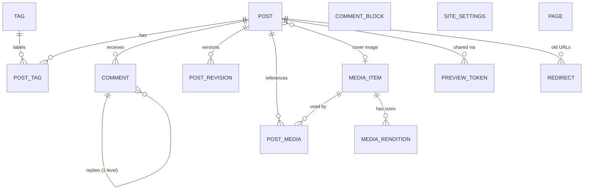

# BlogEngine — Design Document

| | |
|---|---|
| **Status** | Draft for review |
| **Date** | 2026-09-22 |
| **Source** | [`requirements.md`](requirements.md), plus research into existing blog engines (see [Appendix B](#appendix-b--research-sources)) |

---

## 1. Purpose and Goals

BlogEngine is a **simple, personal, single-author blog**. The author writes posts in Markdown and publishes them for others to read and comment on.

### 1.1 Goals

1. **Writing is fast and pleasant.** You write in a Markdown editor with a live preview, add photos without leaving the editor, and autosave protects your work.
2. **Reading is fast and lightweight.** Public pages render on the server as plain HTML. Readers never download the WebAssembly runtime. The target is a Lighthouse performance score of 95 or higher on a post page.
3. **URLs are clean, stable and date-based.** Posts live at `/posts/{yyyy}/{mm}/{dd}/{slug}`, and each shorter prefix of that URL is an archive page.
4. **The author is in control.** Nothing is public until it is explicitly published, and every comment is moderated.
5. **You own your data.** Posts are stored as Markdown and can be exported at any time.

### 1.2 Non-Goals

These are out of scope so the product stays simple:

- Multiple authors, editorial roles or review workflows. There is one author/admin.
- Paid memberships, paywalls or subscriptions with payments.
- A plugin or theme marketplace.
- A WYSIWYG or block editor. Markdown is the only format for authoring posts.
- Multiple sites per installation.

---

## 2. Current Baseline (What the Template Already Provides)

The design builds on the existing solution instead of replacing it.

| Area | Current state | Impact on design |
|---|---|---|
| Framework | .NET 10, Blazor Web App (`BlogEngine.Server` + `BlogEngine.Client`) | Public pages use static SSR, and admin pages use InteractiveWebAssembly. |
| Render modes | **InteractiveWebAssembly only; InteractiveServer is forbidden** (`.claude/rules/blazor.instructions.md`) | Interactive admin components go in `BlogEngine.Client` and use the dual-service and `[PersistentState]` pattern. |
| Shared code | `BlogEngine.Shared` | Holds DTOs, service interfaces, validation, `FieldLengths`, and the **Markdown pipeline**. |
| Data | EF Core 10 + SQL Server; `ApplicationDbContext : AuthDbContext` | New entities go here. Built-in fingerprinting (`CreatedOn`/`ModifiedBy`) and audit logging apply automatically. |
| Soft delete hook | `AuthDbContext.ApplySoftDeletes()` (empty) | Used to move posts to the trash (§6.8). |
| Identity | ASP.NET Core Identity with roles, passkeys, 2FA, and `IEmailSender` (currently no-op) | Reused for the admin login. Public registration is locked down (§12.1). |
| Hosting | Aspire AppHost with a SQL Server container and an EF migrations resource | Adds a media storage resource (§9.3). |
| Logging | Serilog to MSSQL and OpenTelemetry | Kept as is. Adds domain log events. |
| UI | Bootstrap 5.3 (SCSS build via npm), Bootstrap Icons, `form-floating` convention | Kept. Adds an npm/esbuild step for editor and cropper JavaScript. |
| Routing | `LowercaseUrls = true`, no trailing slash | Matches the URL scheme. Slugs are always lowercase. |

**Cleanup item:** `FieldLengths.cs` still contains constants from another domain (barcodes, promotions, payments). Replace them with the blog-specific lengths in §6.9.

---

## 3. Users and Roles

| Role | Who | Capabilities |
|---|---|---|
| **Author / Admin** | You (a single account in the `Admin` role) | Everything in `/admin`: posts, media, comments, tags, pages, settings |
| **Reader** | Anonymous visitors | Read published content, search, subscribe via RSS, submit comments |
| **Commenter** | A reader who submits a comment | Provides a display name and email. No account needed (§8.1). |

---

## 4. Feature Summary

Each feature is tagged with its source:

- **R**: from `requirements.md`
- **N**: new, suggested from research

Each feature also has a priority:

- **MVP**: needed for the first usable release
- **V1**: shortly after the MVP
- **Later**: nice to have

### 4.1 Authoring

| # | Feature | Src | Priority |
|---|---|---|---|
| A1 | Markdown editor for posts | R | MVP |
| A2 | Real-time rendered preview, side by side | R | MVP |
| A3 | Drafts stay hidden until explicitly published | R | MVP |
| A4 | Freeform tags with case-insensitive de-duplication and autocomplete (like Azure DevOps) | R | MVP |
| A5 | Insert media from the library inside the editor | R | MVP |
| A6 | Autosave, plus a local backup of unsaved changes and a warning before leaving with unsaved changes | N | MVP |
| A7 | Summary/excerpt field, auto-generated from the first paragraph if left blank | R (implied by the listing) | MVP |
| A8 | Slug auto-generated from the title and editable until first publish | N | MVP |
| A9 | Scheduled publishing (publish at a future date and time) | N | V1 |
| A10 | Paste or drag-and-drop an image into the editor to upload it and insert it at the cursor | N | V1 |
| A11 | Editor toolbar and keyboard shortcuts (bold, italic, link, heading, code, quote, list, image) | N | MVP |
| A12 | Word count and estimated reading time | N | MVP |
| A13 | Revision history for a post (restore a previous version) | N | V1 |
| A14 | Private preview link for a draft that you can share before publishing | N | V1 |
| A15 | Cover (featured) image for each post | N | V1 |
| A16 | Per-post SEO overrides (meta title and description, social image) | N | V1 |
| A17 | Standalone pages that are not posts (for example `/about`) | N | V1 |
| A18 | Focus or full-screen writing mode | N | Later |

### 4.2 Reading (Public Site)

| # | Feature | Src | Priority |
|---|---|---|---|
| P1 | Post page at `/posts/{yyyy}/{mm}/{dd}/{slug}` | R | MVP |
| P2 | Year and month archives at `/posts/{yyyy}` and `/posts/{yyyy}/{mm}` | R | MVP |
| P3 | `/posts` index showing title, date and summary, newest first, paginated | R | MVP |
| P4 | Day archive at `/posts/{yyyy}/{mm}/{dd}` (completes the URL hierarchy) | N | MVP |
| P5 | Tag pages at `/tags/{slug}` and a tag index at `/tags` | N | MVP |
| P6 | RSS/Atom feed for all posts and for each tag | N | MVP |
| P7 | `sitemap.xml` and `robots.txt` | N | MVP |
| P8 | SEO and social meta tags (canonical URL, Open Graph, Twitter card, JSON-LD `BlogPosting`) | N | V1 |
| P9 | Site search | N | V1 |
| P10 | Previous/next post links and related posts (by shared tags) | N | V1 |
| P11 | Archive overview page (all years and months with post counts) | N | V1 |
| P12 | Syntax highlighting for code blocks, plus a copy button | N | MVP |
| P13 | Heading anchor links, and an optional table of contents for long posts | N | V1 |
| P14 | Light and dark themes (Bootstrap 5.3 color modes; follows the OS setting, with a toggle) | N | V1 |
| P15 | "Last updated" date shown when a post is edited after it is published | N | V1 |
| P16 | 301 redirects when a published post's slug or date changes | N | MVP |

### 4.3 Comments

| # | Feature | Src | Priority |
|---|---|---|---|
| C1 | Readers can submit comments | R | MVP |
| C2 | Moderation queue with approve, reject, spam and delete actions | R | MVP |
| C3 | Block a commenter (by email or IP hash) | R ("blocked") | MVP |
| C4 | Layered spam defenses: honeypot, time trap, rate limiting, link limits, keyword blocklist | N | MVP |
| C5 | The author can reply inline; replies show an "Author" badge and are auto-approved | N | V1 |
| C6 | One level of threaded replies | N | V1 |
| C7 | Per-post comment toggle and auto-close after N days | N | V1 |
| C8 | Auto-approve returning commenters who were previously approved (optional setting) | N | V1 |
| C9 | Email notification to the author about new comments awaiting moderation | N | V1 |
| C10 | Optional external spam or CAPTCHA service (Cloudflare Turnstile, hCaptcha, Akismet) | N | Later |

### 4.4 Media Library

| # | Feature | Src | Priority |
|---|---|---|---|
| M1 | Upload, list and delete images | R | MVP |
| M2 | Edit an image: rotate, resize, and crop with a visual drag-to-crop editor | R | MVP |
| M3 | Pick from the library inside the Markdown editor | R | MVP |
| M4 | Alt text and caption metadata, with alt text prompted when inserting | N | MVP |
| M5 | Strip EXIF data (especially GPS location) on upload, after applying EXIF orientation | N | MVP |
| M6 | Responsive renditions (`srcset`, WebP), lazy loading, and explicit width/height to prevent layout shift | N | V1 |
| M7 | Non-destructive editing: keep the original and allow "Revert to original" | N | V1 |
| M8 | Usage tracking ("used in 3 posts") and a warning before deleting | N | V1 |
| M9 | Detect duplicate uploads by content hash | N | Later |
| M10 | Non-image attachments (PDF, zip) | N | Later |

### 4.5 Administration and Operations

| # | Feature | Src | Priority |
|---|---|---|---|
| O1 | Admin dashboard: drafts, scheduled posts, pending comments, recent activity | N | MVP |
| O2 | Posts list with filters (status, tag, text) | N | MVP |
| O3 | Tag management: rename, merge, delete unused tags | N | V1 |
| O4 | Site settings (title, tagline, author bio, time zone, page size, comment policy, social links) | N | MVP |
| O5 | Public registration locked down; admin seeded on first run | N | MVP |
| O6 | Trash for posts (soft delete with restore) | N | V1 |
| O7 | Export everything (Markdown with front matter plus media) as a zip | N | V1 |
| O8 | Import from Markdown files with front matter | N | Later |
| O9 | Manual redirect management (old URL to new URL) | N | Later |
| O10 | Privacy-friendly view counts (no cookies or third-party trackers) | N | Later |
| O11 | Email newsletter or "subscribe by email" | N | Later |

---

## 5. Architecture

### 5.1 Rendering Strategy

The key decision is to use a different render mode for each audience.

| Area | Render mode | Project | Why |
|---|---|---|---|
| Public site (`/`, `/posts/**`, `/tags/**`, `/search`, pages) | **Static SSR** (no render mode) | `BlogEngine.Server` | Fastest first paint and SEO-friendly. Readers don't download WebAssembly. This matches the "100/100 PageSpeed" approach of Miniblog.Core and Bear Blog. |
| Comment form | **Static SSR form** (`EditForm` + `FormName` + `[SupplyParameterFromForm]`, enhanced form post) | `BlogEngine.Server` | Commenting doesn't require WebAssembly. The honeypot and time trap work naturally with a server post. |
| Small public enhancements (code copy button, theme toggle) | Plain JavaScript modules | `BlogEngine.Server/wwwroot/js` | Small enough that interactivity isn't needed. |
| Admin area (`/admin/**`) | **InteractiveWebAssembly** with prerendering | `BlogEngine.Client` | Live preview, cropping and autosave need a rich UI. This follows the project rule. |

Admin components follow the dual-service pattern required by the project rules:

- **Interfaces** (`IPostAdminService`, `IMediaService`, `ITagService`, `ICommentModerationService`, ...) live in `BlogEngine.Shared`.
- **Server implementations** use `ApplicationDbContext` directly, which prerendering needs.
- **Client implementations** call the `/api/admin/*` endpoints over `HttpClient`.
- **Prerendered state** is carried across with `[PersistentState]` properties and `??=` loads.

The admin layout (`AdminLayout.razor`) lives in `BlogEngine.Client`, because Client pages cannot reference Server components.

### 5.2 Solution Layout (Additions)

```
src/
  BlogEngine.Shared/
    Common/FieldLengths.cs            (blog-specific lengths)
    Markdown/BlogMarkdownPipeline.cs  (single pipeline used by server AND WASM preview)
    Markdown/MediaLinkRewriter.cs
    Text/SlugGenerator.cs, TagNormalizer.cs, ReadingTime.cs
    Contracts/ (DTOs: PostEditDto, PostSummaryDto, TagDto, MediaItemDto, CommentDto, ...)
    Services/  (IPostAdminService, ITagService, IMediaService, ICommentModerationService, ISettingsService)
    Validation/ (validators shared by client and server)
  BlogEngine.Data/
    Models/ Post, PostRevision, Tag, PostTag, Comment, CommentBlock, MediaItem, MediaRendition,
            PostMedia, Page, Redirect, SiteSettings, PreviewToken
    Configurations/ (IEntityTypeConfiguration<T> per entity)
  BlogEngine.Server/
    Components/Pages/Public/ (Posts, PostArchive, PostDetail, Tags, TagDetail, Search, PageDetail)
    Components/Blog/ (PostCard, Pager, CommentList, CommentForm, TagBadge, SeoHead)
    Endpoints/ (AdminPostsEndpoints, AdminMediaEndpoints, ..., FeedEndpoints, SitemapEndpoints, MediaEndpoints)
    Services/ (Server* implementations, PublicPostQueries, MediaProcessor, SpamGuard, CacheInvalidator)
    Storage/ (IMediaStorage, FileSystemMediaStorage, AzureBlobMediaStorage)
  BlogEngine.Client/
    Layout/AdminLayout.razor
    Pages/Admin/ (Dashboard, PostsList, PostEditor, MediaLibrary, MediaEditor, Comments, Tags, Pages, Settings)
    Components/ (MarkdownEditor, MarkdownPreview, TagInput, MediaPicker, ImageCropper, ConfirmDialog)
    Services/ (Client* implementations)
    wwwroot/js/ (editor.js — CodeMirror bundle, cropper.js interop)
```

### 5.3 New Dependencies

| Package | Where | Purpose |
|---|---|---|
| `Markdig` | Shared | CommonMark rendering, used on both server and WASM (pure managed code, so it runs in the browser) |
| `HtmlSanitizer` (Ganss.Xss) | Server | Sanitizes rendered comment HTML, and post HTML as a defense in depth |
| `SixLabors.ImageSharp` | Server | Decode, rotate, crop, resize, strip EXIF, encode WebP. Licensed under the Six Labors Split License; free for open source or for companies under $1M revenue. |
| `System.ServiceModel.Syndication` | Server | RSS 2.0 and Atom feeds |
| `Aspire.Hosting.Azure.Storage` / `Aspire.Azure.Storage.Blobs` | AppHost / Server | Optional blob storage for media (Azurite in dev) |
| npm: `codemirror` (v6) + `@codemirror/lang-markdown` | Client JS | Markdown editor surface |
| npm: `cropperjs` (v2, web components) | Client JS | Visual crop and rotate UI |
| npm: `highlight.js` | Server JS | Code block highlighting on public pages |
| npm: `esbuild` | build | Bundles the editor and cropper modules. A `js-build` script is added next to `sass-dev`/`sass-prod`. |

---

## 6. Domain Model

### 6.1 Entity Relationship Overview



Every entity derives from `FingerPrintEntityBase` (except join tables), so audit columns and audit logging come for free.

### 6.2 Post

| Field | Type | Notes |
|---|---|---|
| `Id` | int | PK |
| `Title` | nvarchar(200) | Required |
| `Slug` | nvarchar(200) | Lowercase, `[a-z0-9-]`. **Unique per publish date** (see below). |
| `Summary` | nvarchar(500) | Shown on listing pages and used as the meta description. If blank, it is generated from the first ~160 characters of plain text. |
| `ContentMarkdown` | nvarchar(max) | Source of truth |
| `ContentHtml` | nvarchar(max) | Cached render output, regenerated on save or when referenced media changes |
| `Status` | enum `PostStatus` | `Draft`, `Published` |
| `PublishedOn` | datetimeoffset? | Set on first publish. Editable. A future value means *scheduled*. |
| `PublishedDateLocal` | date (computed/persisted) | The publish date in the blog's time zone. Drives the URL segments and archive queries. |
| `LastUpdatedOn` | datetimeoffset? | Set when the content changes after publishing. Shown as "Updated …". |
| `CoverMediaId` | int? | FK to `MediaItem` |
| `AllowComments` | bool | Default comes from settings |
| `CommentsCloseOn` | datetimeoffset? | Derived from the auto-close setting at publish time |
| `IsFeatured` | bool | Pins the post to the top of the home page |
| `WordCount`, `ReadingMinutes` | int | Computed on save |
| `MetaTitle`, `MetaDescription` | nvarchar | Optional SEO overrides |
| `IsDeleted`, `DeletedOn` | bool / datetimeoffset? | Trash (soft delete) |
| `RowVersion` | rowversion | Optimistic concurrency, so two browser tabs cannot silently overwrite each other |

**Indexes**

- Unique `(PublishedDateLocal, Slug)` filtered on `Status = Published`
- A unique `Slug` among drafts is not required
- `(Status, PublishedOn DESC)` for listings

The URL contains the date, so two posts could share a slug on different days. For simplicity, **slugs must also be globally unique**, which is simpler for search and redirects. The date-based uniqueness check is a secondary safeguard.

### 6.3 Post Visibility Rule

A post is **publicly visible** only if all of the following are true:

```
Status == Published  &&  PublishedOn <= UtcNow  &&  !IsDeleted
```

This rule is implemented once, as a query extension (`.VisibleToPublic(clock)`), and every public query uses it. Scheduled publishing therefore needs **no background job**, because a post appears once its time passes. A lightweight `BackgroundService` still runs every minute to evict caches and send notifications when a scheduled post goes live (§11).

```mermaid
stateDiagram-v2
    [*] --> Draft
    Draft --> Scheduled: Publish (future date)
    Draft --> Published: Publish (now)
    Scheduled --> Published: time passes
    Scheduled --> Draft: Unschedule
    Published --> Draft: Unpublish (confirm; URL 404s)
    Draft --> Trash
    Published --> Trash
    Trash --> Draft: Restore
    Trash --> [*]: Empty trash
```



("Scheduled" is not stored as its own status. It is `Published` with a future `PublishedOn`.)

### 6.4 Tags

| Field | Type | Notes |
|---|---|---|
| `Id` | int | PK |
| `Name` | nvarchar(50) | Display form as first entered, for example `C#` |
| `NormalizedName` | nvarchar(50) | **Unique index.** Used for duplicate detection. |
| `Slug` | nvarchar(60) | **Unique index.** Used in `/tags/{slug}`. |
| `Description` | nvarchar(500)? | Optional; shown on the tag page |

`PostTag(PostId, TagId)` has a composite primary key.

**Normalization rules** (`TagNormalizer`, in Shared so the client can show "already exists" before saving):

1. Trim the name, collapse internal whitespace to a single space, and apply Unicode NFKC normalization.
2. `NormalizedName = name.ToUpperInvariant()`. As a result, `C#`, `c#` and ` c# ` all resolve to the same tag.
3. Reject empty names, names over 50 characters, and commas or semicolons (which are used as delimiters in the input).

**Slug rules for tags:** a plain slugifier would turn `C#` and `C` into the same slug `c`. Symbols are therefore mapped before slugifying:

- `#` → `sharp`
- `+` → `plus`
- a leading `.` → `dot`
- `&` → `and`

So `C#` becomes `csharp`, `C++` becomes `cplusplus`, and `.NET` becomes `dotnet`. If a slug still collides, it gets a `-2` suffix.

**Behavior (modeled on Azure DevOps):**

- **Input:** tags appear as chips. Typing shows existing tags that match case-insensitively. Enter, Tab or a comma commits a chip.
- **Matching existing tags:** if what you typed matches an existing tag's `NormalizedName`, the existing tag is used with its original casing, so typing `c#` gives you the chip `C#`.
- **Creating new tags:** a name with no match is created in the same transaction when the post is saved. It is then offered in autocomplete for future posts.
- **Concurrency:** the unique index on `NormalizedName` is the final guard. If two saves race, the loser catches the unique violation and reloads the existing tag.
- **Unused tags:** tags with zero posts stay in the database until they are cleaned up from **Tag management**, where you can rename, merge, or delete unused tags. Merging moves every `PostTag` to the target tag and adds a redirect from the old tag slug.
- **Tag pages:** public tag pages list only tags that have at least one visible post.

### 6.5 Comments

| Field | Type | Notes |
|---|---|---|
| `Id` | int | PK |
| `PostId` | int | FK |
| `ParentCommentId` | int? | Only one level deep. A reply to a reply attaches to the top-level parent. |
| `AuthorName` | nvarchar(100) | Required |
| `AuthorEmail` | nvarchar(320) | Required and **never displayed**. Used for notifications, blocking and an avatar hash. |
| `AuthorUrl` | nvarchar(300)? | Optional. Rendered with `rel="nofollow ugc noopener"`. |
| `BodyMarkdown` | nvarchar(4000) | Limited Markdown (§8.2) |
| `BodyHtml` | nvarchar(max) | Sanitized render output |
| `Status` | enum | `Pending`, `Approved`, `Rejected`, `Spam` |
| `IsAuthorReply` | bool | Set when the admin posts it |
| `IpHash` | char(64) | SHA-256 of the IP address plus a secret salt. The raw IP is never stored. |
| `UserAgent` | nvarchar(300) | Moderation context |
| `SpamScore`, `SpamReasons` | int / nvarchar | Output from `SpamGuard`, shown to the moderator |
| `ModeratedOn`, `ModeratedBy` | | |

`CommentBlock` records blocked commenters and content:

| Field | Values |
|---|---|
| `Kind` | `Email`, `IpHash`, `Keyword`, `Domain` |
| `Value` | The value to block |
| `Note` | Free text |
| `CreatedOn` | Timestamp |

"Delete" is a **hard delete**. "Reject" keeps the comment hidden so that it still counts as a signal in future spam scoring.

### 6.6 Media

**`MediaItem`**

| Field | Type | Notes |
|---|---|---|
| `Id` | int | PK |
| `PublicId` | char(12) | Short random ID used in URLs, so URLs don't reveal the row count |
| `FileName` | nvarchar(200) | Slugified original name, for example `sunset-at-lake.jpg`. Used in the URL for SEO. |
| `OriginalStorageKey` | nvarchar(400) | The original upload after orientation fix and EXIF removal. Never modified. |
| `CurrentStorageKey` | nvarchar(400) | Result of applying `EditOperations` to the original |
| `EditOperationsJson` | nvarchar(max)? | For example `{ "rotate": 90, "crop": {x,y,w,h}, "resize": {w,h} }`. Null means unedited. |
| `ContentType` | nvarchar(50) | Detected by decoding the file, **not** from the extension |
| `Width`, `Height`, `SizeBytes` | int / long | Dimensions of the *current* version |
| `AltText` | nvarchar(300) | Strongly encouraged. The editor prompts for it on insert. |
| `Caption` | nvarchar(500)? | Rendered as `<figcaption>` |
| `ContentHash` | char(64) | SHA-256, for duplicate detection |
| `Version` | int | Incremented on every edit. Appended to URLs for cache busting. |

**`MediaRendition`**: `(MediaItemId, Width, Format, StorageKey, SizeBytes)`. These are pre-generated, resized copies.

**`PostMedia`**: `(PostId, MediaItemId)`. Rebuilt on each save by scanning the Markdown for media URLs, and used for usage tracking.

### 6.7 Supporting Entities

| Entity | Purpose |
|---|---|
| `PostRevision` | `(PostId, Title, ContentMarkdown, SavedOn, Kind = Autosave\|Manual\|Publish)`. Keeps all manual and publish revisions, and only the latest N (default 20) autosaves. |
| `PreviewToken` | `(PostId, Token (256-bit random, URL-safe), ExpiresOn)`. Backs `/preview/{token}`, which renders a draft with `noindex`. |
| `Redirect` | `(FromPath unique, ToPath, StatusCode = 301, HitCount)`. Created automatically when a published post's slug or date changes, or when tags are merged. |
| `Page` | Standalone pages (`/about`, `/now`, `/uses`). Uses the same Markdown fields as a post, has no date or tags, and appears optionally in the nav with an order. |
| `SiteSettings` | A single-row table (§13) |

### 6.8 Soft Delete

`AuthDbContext.ApplySoftDeletes()` is implemented for `Post` and `Page`. `Remove()` becomes `IsDeleted = true` plus `DeletedOn`. A global query filter hides deleted rows, and the admin Trash view uses `IgnoreQueryFilters()`. **Empty trash** permanently deletes the post and cascades to `PostTag`, `Comment`, `PostRevision`, `PostMedia` and `PreviewToken`.

### 6.9 Field Lengths (Replacing the Template Constants)

```csharp
public static class FieldLengths
{
    public const int PersonName = 100;
    public const int Email = 320;
    public const int Url = 300;
    public const int PostTitle = 200;
    public const int Slug = 200;
    public const int PostSummary = 500;
    public const int MetaTitle = 70;
    public const int MetaDescription = 160;
    public const int TagName = 50;
    public const int TagSlug = 60;
    public const int TagDescription = 500;
    public const int CommentBody = 4000;
    public const int MediaFileName = 200;
    public const int AltText = 300;
    public const int Caption = 500;
    public const int StorageKey = 400;
}
```

---

## 7. URLs and Routing

### 7.1 Public Routes (Static SSR)

| Route | Page | Notes |
|---|---|---|
| `/` | Home | Featured post(s), then the latest N posts. Links to `/posts`. |
| `/posts` | Post index | Title, date and summary, **newest first**, paginated with `?page=2` (default 10 per page, configurable) |
| `/posts/{year:int:range(1900,9999)}` | Year archive | All visible posts with `PublishedDateLocal` in that year, newest first |
| `/posts/{year}/{month:int:range(1,12)}` | Month archive | Accepts `09` and `9`; always links using two digits |
| `/posts/{year}/{month}/{day:int:range(1,31)}` | Day archive | Completes the hierarchy, so URL hacking works as readers expect |
| `/posts/{year}/{month}/{day}/{slug}` | Post | See the resolution rules below |
| `/tags` | Tag index | Tag cloud or list with counts |
| `/tags/{slug}` | Tag archive | Paginated |
| `/archive` | Archive overview | Years, then months, with counts |
| `/search?q=` | Search results | Paginated |
| `/{pageSlug}` | Standalone page | Lowest route priority. Reserved words are rejected as page slugs. |
| `/preview/{token}` | Draft preview | Sends `X-Robots-Tag: noindex` |
| `/feed.xml`, `/atom.xml` | Site feeds | Latest 20 posts, full content |
| `/tags/{slug}/feed.xml` | Per-tag feed | |
| `/sitemap.xml`, `/robots.txt` | SEO | |
| `/media/{publicId}/{fileName}` | Media file | `?w=640` selects the nearest rendition, and `?v=` is used for cache busting |

**Archive pages** (`/posts/{yyyy}`, `/posts/{yyyy}/{mm}`, `/posts/{yyyy}/{mm}/{dd}`) use the same `PostList` component as `/posts`. The heading changes (for example "Posts from September 2026") and breadcrumbs link to the parent periods. A valid date with no visible posts returns a **404** instead of an empty 200 page, so search engines don't index empty pages.

**Post resolution:**

1. Look up the visible post by `Slug`.
2. If the post exists but the date in the URL doesn't match its `PublishedDateLocal`, return a **301 to the canonical URL**. This covers dates that were edited and zero-padding differences.
3. If no post matches, look up the `Redirect` table for the path. Return a 301 if found, otherwise call `NavigationManager.NotFound()`.

**Time zone:** URL dates use the **blog's configured time zone** (`SiteSettings.TimeZoneId`, for example `America/Chicago`), not UTC. A post published at 9 PM Central on Sept 22 should have a URL that says `/22/`, not `/23/`. All timestamps are stored as UTC `DateTimeOffset`. `PublishedDateLocal` is computed on save. If the time zone setting changes, a maintenance action recomputes the stored dates and creates redirects.

### 7.2 Slug Rules (`SlugGenerator`)

1. Lowercase the text and strip diacritics (`é` → `e`).
2. Replace non-alphanumeric runs with a hyphen `-`, then trim hyphens from both ends.
3. Truncate to 80 characters at a word boundary.
4. The slug is generated from the title while the post is a draft and **locked after the first publish**. You can still edit it manually. Changing it creates a redirect and shows a warning.
5. If the slug is already taken, append `-2`, `-3`, and so on.

### 7.3 Admin Routes (InteractiveWebAssembly, `[Authorize(Roles = "Admin")]`)

| Route | Purpose |
|---|---|
| `/admin` | Dashboard |
| `/admin/posts` | List with status filter (All, Drafts, Scheduled, Published, Trash), tag filter, search |
| `/admin/posts/new`, `/admin/posts/{id}` | Editor |
| `/admin/posts/{id}/revisions` | Revision history and diff |
| `/admin/media` | Media library grid |
| `/admin/media/{id}` | Media details and editor (crop, rotate, resize) |
| `/admin/comments` | Moderation queue, with a Pending tab by default |
| `/admin/tags` | Tag management |
| `/admin/pages`, `/admin/pages/{id}` | Standalone pages |
| `/admin/settings` | Site settings and comment policy |
| `/admin/redirects` | (Later) Manual redirects |

### 7.4 Admin API (Minimal APIs, `/api/admin/*`, Admin role required)

| Area | Endpoints |
|---|---|
| **Posts** | `GET /posts` (query), `GET /posts/{id}`, `POST /posts`, `PUT /posts/{id}` (with `RowVersion`), `POST /posts/{id}/autosave`, `POST /posts/{id}/publish` (`{ publishOn? }`), `POST /posts/{id}/unpublish`, `DELETE /posts/{id}` (to trash), `POST /posts/{id}/restore`, `GET /posts/{id}/revisions`, `POST /posts/{id}/preview-token`, `POST /posts/slug-check` |
| **Tags** | `GET /tags?search=` (autocomplete, top 10, ordered by usage), `PUT /tags/{id}` (rename), `POST /tags/{id}/merge/{targetId}`, `DELETE /tags/{id}` (only if unused) |
| **Media** | `GET /media?search=&page=&unused=`, `POST /media` (multipart, multiple files), `PUT /media/{id}` (alt text or caption), `POST /media/{id}/edit` (edit operations), `POST /media/{id}/revert`, `DELETE /media/{id}?force=` |
| **Comments** | `GET /comments?status=`, `POST /comments/{id}/approve\|reject\|spam`, `DELETE /comments/{id}`, `POST /comments/bulk`, `POST /comments/{id}/reply`, `POST /comment-blocks`, `DELETE /comment-blocks/{id}` |
| **Settings** | `GET /settings`, `PUT /settings` |
| **Export** | `GET /export` (streams a zip) |

The API uses cookie authentication from Identity on the same origin. Mutating endpoints require the antiforgery token, which the WASM `HttpClient` sends in a header via a `DelegatingHandler`. This protects against CSRF because the API relies on cookies.

---

## 8. Comments in Detail

### 8.1 Commenter Identity

Commenters **do not create accounts**. For a personal blog, requiring registration kills engagement and adds moderation overhead for user accounts. The form asks for:

- Name (required)
- Email (required, never shown, used for blocking, notifications and avatars)
- Website (optional)
- Comment

"Remember me" stores the name, email and website in `localStorage` through a tiny script, not a cookie.

Avatars are optional (setting). They use Gravatar (SHA-256 of the email) with an identicon fallback. When avatars are off, a colored initial is shown, so no third-party requests are made.

### 8.2 Comment Content

- Markdown is limited to paragraphs, emphasis, inline code, code blocks, links, blockquotes and lists. Headings, images, tables and raw HTML are **disabled** (`DisableHtml()` plus a restricted pipeline).
- Output is always passed through `HtmlSanitizer`. Markdig is not a sanitizer, and its documentation says so explicitly.
- Every link gets `rel="nofollow ugc noopener"`.

### 8.3 Spam Defense (`SpamGuard`)

Checks run in order. Each one either **rejects outright** (silently, returning a generic "thanks" to bots) or **adds to a score**.

| Check | Action |
|---|---|
| Honeypot field (visually hidden, with an innocuous name such as `website2`) is filled in | Discard |
| Time trap: the form timestamp is signed with Data Protection, and submission happens less than 3 seconds after render or more than 24 hours after | Discard |
| Rate limit: ASP.NET Core `RateLimiter`, fixed window of 3 comments per 5 minutes per IP hash | 429 with a friendly message |
| Email, IP hash or domain is in `CommentBlock` | Mark as Spam |
| Keyword blocklist match | +50 |
| More than 2 links | +30 per extra link |
| Body is shorter than 3 characters or consists only of a URL | +40 |
| (Later) Akismet, Turnstile or hCaptcha verdict | ±100 |

A score of 50 or more goes to `Spam`. Anything else goes to `Pending`, or directly to `Approved` when *auto-approve returning commenters* is on and the email has a previously approved comment.

### 8.4 Moderation UX

- **Queue:** the admin comments page has Pending, Approved, Spam and Rejected tabs. Each row shows:
  - post title, author name and email, relative time
  - body preview, spam score and reasons
  - actions: **Approve**, **Reject**, **Spam**, **Delete**, **Block commenter** (adds an email and IP block and marks every comment from that commenter as spam)
- **Bulk actions:** select several comments and apply one action. "Empty spam" permanently deletes all spam older than 30 days.
- **Reply:** the author can reply directly from the queue. The reply is auto-approved and approving it also approves the parent comment.
- **Dashboard:** shows a pending-comment badge. The nav shows a count.
- **Notifications (V1):** an email to the author for each new pending comment, sent through the existing `IEmailSender`, with an SMTP or SendGrid implementation replacing the no-op sender.
- **Public display:** after submitting, the commenter sees "Your comment is awaiting moderation." Their pending comment is **not** shown back to them. Showing it would require session state, which the static-SSR approach avoids.

### 8.5 Comment Closing

- Per-post toggle: `AllowComments`.
- Global setting: close comments N days after publishing (default off). Closed posts show "Comments are closed." with existing comments still visible.
- Global kill switch: `CommentsEnabled = false` hides the form everywhere.

---

## 9. Media Library in Detail

### 9.1 Upload Pipeline

```
Browser (multi-file drag/drop or paste in editor)
  → POST /api/admin/media  (multipart; per-file limit 20 MB, configurable)
    1. Decode with ImageSharp (rejects anything that isn't a real image; extension is ignored)
       Allowed: JPEG, PNG, GIF, WebP. (HEIC: see open question Q6.)
    2. Apply EXIF orientation (AutoOrient) so rotation is baked into pixels
    3. Strip EXIF/IPTC/XMP metadata (removes GPS location from phone photos)
    4. Optional downscale if longer edge > 4000 px (setting) to keep storage sane
    5. Compute SHA-256; warn if a duplicate exists (Later: offer to reuse)
    6. Save as the "original" in storage; current = original
    7. Generate renditions (§9.4)
    8. Insert MediaItem row; return MediaItemDto (with URLs)
```

Uploads show individual progress bars. If one file fails, the others are unaffected.

### 9.2 Image Editor (Rotate, Resize, Crop)

The editor is a Client component (`MediaEditor.razor`) that wraps **Cropper.js v2** through JavaScript interop (`cropper-canvas`, `cropper-image`, `cropper-selection`, `cropper-shade`, `cropper-handle` web components).

**Controls:**

- **Rotate:** buttons for 90° left and 90° right. Flip horizontal and vertical are cheap extras.
- **Crop:** drag the crop box directly on the image, with a dimmed area outside the selection so you see exactly what the result will look like. Aspect ratio presets: Free, Original, 1:1, 4:3, 3:2, 16:9. The selected region's pixel dimensions are shown live.
- **Resize:** width and height inputs (`form-floating`) with an aspect-ratio lock. Upscaling is not allowed; the maximum is the cropped size.
- **Preview:** a live thumbnail of the result generated from the cropper's canvas.
- **Actions:**
  - **Save**: writes a new current version.
  - **Save as copy**: creates a new `MediaItem` so the original stays untouched in existing posts.
  - **Revert to original**
  - **Cancel**

**How edits are applied:** the browser sends only the *operations* (rotation, flips, and the crop rectangle **in the original image's natural pixel coordinates**, and the target size). The server re-applies them to the stored original with ImageSharp. This gives full-quality output, preserves the original for "Revert", and doesn't trust client-generated bitmaps.

**Order of operations:** rotate/flip → crop → resize. Saving increments `Version`, regenerates renditions, and invalidates the cached `ContentHtml` of every post in `PostMedia` for that item.

### 9.3 Storage Abstraction

```csharp
public interface IMediaStorage
{
    Task SaveAsync(string key, Stream content, string contentType, CancellationToken ct);
    Task<Stream?> OpenReadAsync(string key, CancellationToken ct);
    Task DeleteAsync(string key, CancellationToken ct);
    Task DeletePrefixAsync(string prefix, CancellationToken ct);
}
```

- **`FileSystemMediaStorage`** (default): stores files under a configurable root such as `App_Data/media/{publicId}/…`. In Aspire this is a bind mount or volume so files survive restarts.
- **`AzureBlobMediaStorage`** (optional): uses Aspire `AddAzureStorage().RunAsEmulator()` (Azurite) in development and a real storage account in production.

Keys are laid out as `{publicId}/original.{ext}`, `{publicId}/v{version}/current.{ext}` and `{publicId}/v{version}/{width}.webp`.

### 9.4 Delivery

- **Renditions:** widths 320, 640, 960, 1280, 1920 (skipping any wider than the image), in WebP plus the original format as the largest fallback.
- **`/media/{publicId}/{fileName}?w=&v=`:** served by a Minimal API endpoint that streams from storage with the following headers:
  - `Cache-Control: public, max-age=31536000, immutable` when `v` matches the current version, otherwise a short max-age with an ETag
  - `Content-Type` and `ETag`
  - `X-Content-Type-Options: nosniff`
- **Rendered output:** the Markdown renderer turns a library image into:

```html
<figure>
  <picture>
    <source type="image/webp" srcset="/media/ab12cd34ef56/sunset.jpg?w=640&v=3&f=webp 640w, … 1280w" sizes="(min-width: 768px) 720px, 100vw">
    
  </picture>
  <figcaption>Sunset over the lake</figcaption>
</figure>
```

### 9.5 Media in the Markdown Editor

- **Insert image** (toolbar button, or `Ctrl+Shift+I`) opens the `MediaPicker` modal. It contains a searchable grid of the library, an Upload tab and a "Recently used" row. After you select an image, a small form asks for:
  - alt text (pre-filled from the library)
  - size: full width, medium or small
  - alignment: none or center
- **Syntax:** the picker inserts **standard Markdown** at the cursor, so posts stay portable:

  ```markdown
  
  ```

  The optional title becomes the caption. A size hint is added through Markdig's generic attributes extension, for example `{.img-medium}`.
- **Paste or drop:** pasting or dropping an image uploads it immediately. The editor inserts a placeholder `` and replaces it with the real link when the upload finishes.
- **Preview:** the live preview renders library images with the same `MediaLinkRewriter`, so the preview matches the published page.

### 9.6 Deleting Media

- Deleting an image that **is not used** asks for confirmation, then removes the row and all its storage keys.
- Deleting an image that **is used** shows which posts use it ("Used in 3 posts: …"). You can **Cancel** or **Delete anyway**. With "Delete anyway", those posts render a visible "missing image" placeholder in the admin preview and silently omit the image publicly. An admin warning lists the broken references.
- The library has an "Unused" filter to help clean up.

---

## 10. Markdown Pipeline and Editor

### 10.1 One Pipeline, Two Hosts

`BlogMarkdownPipeline` in **`BlogEngine.Shared`** builds the Markdig pipeline. **The same code** renders posts on the server when they are saved and renders the live preview in the browser (Markdig is pure managed .NET and runs in WebAssembly). As a result, **the preview is exactly what gets published**, and the preview doesn't need a server round trip for each keystroke.

Enabled extensions:

| Extension | Purpose |
|---|---|
| Pipe tables, grid tables | Tables |
| Task lists | `- [x]` |
| Footnotes | `[^1]` |
| Auto identifiers | Heading IDs used for anchors and the table of contents |
| Emphasis extras | Strikethrough, marked text |
| Auto links | Bare URLs become links |
| Media links | YouTube and Vimeo URLs become privacy-enhanced embeds (`youtube-nocookie.com`) |
| Generic attributes | `{.class}` hints for images |
| Figures | Figure blocks with captions |
| Custom `MediaLinkRewriter` | Library image to responsive `<picture>` (§9.4) |
| Custom `ExternalLinkRewriter` | `rel="noopener"` and a small icon for external links |

Raw HTML is **allowed in posts**, because the author is trusted and may want to embed things. The output still goes through `HtmlSanitizer` with a permissive allowlist that includes `iframe` only from YouTube and Vimeo. This protects against a compromised admin account storing script.

### 10.2 Editor Component (`MarkdownEditor`)

**Layout:** a split view with the editor on the left and the preview on the right. You can switch the layout between split, editor only and preview only. On narrow screens the panes become tabs.

**Editor surface:** CodeMirror 6, bundled with esbuild into `wwwroot/js/editor.js` and wrapped through JavaScript interop. It provides:

- Markdown syntax highlighting, line wrapping, and bracket and list continuation (pressing Enter in a list continues the list)
- Keyboard shortcuts: `Ctrl/Cmd + B`, `I`, `K` (link), `` ` `` (code), `Shift+I` (image), `S` (save)
- Paste and drop hooks that start media uploads
- Scroll sync between the editor and preview, based on block-level source position maps from Markdig (`UsePreciseSourceLocation`)

**Preview update:** content changes are debounced by 200 ms on the JavaScript side and then passed to .NET, which renders them with Markdig and updates the preview. Prism or highlight.js then runs on the preview pane.

**Save model:**

- **Autosave:** every 30 seconds and on blur while the content is dirty. It writes a `PostRevision(Kind = Autosave)` and updates the draft. On a published post, autosave **does not change the live content**. It saves a pending revision, and **Update** publishes it. This avoids half-finished edits appearing live.
- **Local backup:** every change is also written to `localStorage` under `draft:{postId}`. If the browser crashes, the editor offers "Restore unsaved changes from 10:42?"
- **Leaving the page:** `NavigationLock` plus a `beforeunload` handler warn when there are unsaved changes.
- **Concurrency:** the `RowVersion` check shows "This post was changed in another tab. Reload or overwrite?"

**Sidebar:**

- Status and publish controls: Publish now, or schedule with a date and time picker in the blog's time zone
- Slug, with inline validation
- Summary
- Tags (`TagInput`)
- Cover image
- Allow comments
- Featured
- SEO overrides
- Word count and reading time
- "Get preview link"

### 10.3 Code Highlighting (Public)

**highlight.js** is loaded as a small deferred module **only on pages that contain code blocks**. The renderer flags this. The module also adds copy buttons. This keeps readers' JavaScript payload close to zero on text-only posts. (Alternative: highlight on the server at save time. Q7 compares the options.)

---

## 11. Caching and Performance

| Layer | Approach |
|---|---|
| Rendered HTML | Stored in `Post.ContentHtml` and regenerated on save or media change, so no Markdown rendering happens per request |
| Public queries | `HybridCache` (in-memory, with an optional distributed layer) for post lists, archives, tag counts, feeds and sitemap. Entries are tagged (`posts`, `tag:{id}`, `post:{id}`, `comments:{postId}`). |
| Invalidation | `CacheInvalidator` evicts tags on publish, update, unpublish and delete, on comment approval, and on settings changes. A `ScheduledPublishWatcher` background service runs every minute and evicts `posts` when a scheduled post's time passes. |
| Output caching | **Not used for post pages.** The comment form needs a per-user antiforgery token, and a cached page would serve stale tokens. Feeds, the sitemap, `robots.txt` and media *are* output-cached or served with cache headers. |
| Media | Versioned immutable URLs, WebP renditions, lazy loading, explicit dimensions |
| Transport | Response compression (Brotli/gzip) and HTTP/2 |
| JavaScript for readers | Only highlight.js (when needed), the theme toggle and "remember me". No WebAssembly. |

**Targets:** post page time to first byte under 200 ms from cache. Lighthouse 95 or higher for performance, accessibility, best practices and SEO.

---

## 12. Security

### 12.1 Accounts and Authentication

- **Registration is disabled** once an admin account exists. The `/Account/Register` page returns 404, and its nav link is hidden when the setting `AllowRegistration = false` (the default).
- **First run:** if no users exist, `/setup` creates the admin (email, password, display name) and assigns the `Admin` role. After that, `/setup` returns 404. Alternatively, the admin can be seeded from Aspire parameters (`admin-email`, `admin-password`) in the same style as the existing `sql-password` parameter.
- **Passkeys and 2FA** from the template are encouraged. The dashboard shows a nudge if neither is set up.
- **Lockout** after failed attempts (Identity defaults).
- **Access control:** all `/admin` pages and `/api/admin` endpoints require the `Admin` role through a single authorization policy, `AdminOnly`.

### 12.2 Content and Input

- Comment HTML is always sanitized. Post HTML is sanitized with a permissive allowlist.
- Uploads are validated by **decoding** them, size-limited and metadata-stripped. They are never served from a path the user controls. Uploaded SVG is not allowed (script risk).
- Preview tokens have 256 bits of entropy, expire after 7 days by default, can be revoked, and are served with `noindex`.
- The Content Security Policy header allows only self, the Bootstrap Icons CDN (or self-hosted icons, which is preferred), and YouTube and Vimeo frames. The existing CDN link for Bootstrap Icons should move to npm and self-hosting to simplify the CSP.
- Other headers: `Referrer-Policy: strict-origin-when-cross-origin`, `X-Content-Type-Options`, and `Permissions-Policy`.

### 12.3 Privacy

- No third-party analytics by default. Gravatar is optional.
- Commenter IP addresses are only stored as salted hashes. Emails are never displayed.
- A privacy page template is provided under standalone pages.

### 12.4 Abuse Protection

- Rate limiting on the comment post, the login page and the search page.
- Serilog captures moderation actions and failed spam checks. The existing `AuditLog` records all entity changes.

---

## 13. Site Settings

These are stored in the `SiteSettings` single-row table, edited at `/admin/settings`, and cached.

| Group | Settings |
|---|---|
| **Identity** | Site title, tagline, description (meta), author display name, author bio (Markdown), author avatar (media), social links (GitHub, Mastodon, LinkedIn, Bluesky, …), favicon (media) |
| **Reading** | Posts per page (10), show full content or summary in feeds (full), home page mode (latest posts, or a featured post plus latest) |
| **Localization** | Time zone (IANA ID), date display format |
| **Comments** | Enabled, require approval (always true for the MVP), auto-approve returning commenters, close after N days (0 = never), max links, keyword blocklist, avatars on or off |
| **Notifications** | Email me on new pending comments |
| **Media** | Max upload size in MB, downscale originals above N px, rendition widths |
| **SEO** | Default social image, `robots.txt` extras, "discourage search engines" switch (`noindex` everywhere, useful before launch) |

---

## 14. Public Page Layouts

### 14.1 Post List (`/posts` and archives)

```
┌──────────────────────────────────────────────────────────┐
│ Home › Posts › 2026 › September                          │  (breadcrumb on archives)
│ Posts from September 2026                                │
├──────────────────────────────────────────────────────────┤
│ Building a blog engine with Blazor                       │  ← title (link)
│ Sep 22, 2026 · 6 min read · #dotnet #blazor              │
│ Why I built my own blog engine instead of using…         │  ← summary
├──────────────────────────────────────────────────────────┤
│ …                                                        │
├──────────────────────────────────────────────────────────┤
│            « Newer        Page 2 of 7        Older »     │
└──────────────────────────────────────────────────────────┘
```

### 14.2 Post Page

The post page contains, from top to bottom:

1. Title, publish date (linked to the day archive), "Updated" date if any, reading time and tags
2. Cover image, if set
3. Optional table of contents for posts with 4 or more H2 headings
4. Content
5. Tags again, and share links (copy link, Mastodon, Bluesky, LinkedIn, email). Plain links are used, not widgets, so no trackers are loaded.
6. Previous and next posts, and up to 3 related posts
7. Comments section: a list of approved comments (oldest first, replies indented), then the form or a "closed" notice

**Head content:** `<PageTitle>`, and a `SeoHead` component that emits the meta description, canonical URL, Open Graph and Twitter tags, the JSON-LD `BlogPosting`, and the RSS `<link rel="alternate">`.

---

## 15. Search

- **MVP:** EF query with `LIKE` over `Title`, `Summary` and `ContentMarkdown` for visible posts, ranked with title matches first. This is fine at personal-blog scale, which is hundreds of posts.
- **Later:** SQL Server full-text search (`CONTAINSTABLE` ranking) if the container image supports it, or an in-memory Lucene.NET index rebuilt when a post is published.
- The navbar has a search box that submits a plain GET form to `/search?q=`, so no JavaScript is needed.

---

## 16. Feeds and SEO Details

- **RSS 2.0 at `/feed.xml` and Atom at `/atom.xml`:** latest 20 visible posts, full sanitized HTML with absolute URLs, and categories taken from the tags. There is also a per-tag feed at `/tags/{slug}/feed.xml`.
- **Sitemap:** home, `/posts`, every visible post (with `lastmod` = `LastUpdatedOn ?? PublishedOn`), every tag page with posts, and every standalone page.
- **`robots.txt`:** `Disallow: /admin`, `/api`, `/preview`, `/Account`, plus a `Sitemap:` line.
- **Canonical URLs:** always lowercase, zero-padded, with no trailing slash and no `?page=1`.
- **Autodiscovery:** a feed `<link>` on every page.

---

## 17. Export and Import

- **Export (V1):** `/admin/settings → Export` downloads `blog-export-{date}.zip`, containing:

  ```
  posts/2026-09-22-building-a-blog-engine.md   (YAML front matter: title, slug, date, tags, summary, status, cover)
  pages/about.md
  media/{publicId}/original.jpg (+ metadata.json with alt/caption/edit ops)
  comments.json
  settings.json
  ```

  The front matter follows the Hugo and Jekyll conventions so the content is portable.
- **Import (Later):** upload a zip in the same format, or a folder of Hugo or Jekyll Markdown files. Media is matched by filename.

---

## 18. Observability

- The existing Serilog and OpenTelemetry setup is kept. The following structured events are added:
  - `PostPublished`, `PostUnpublished`
  - `CommentSubmitted` (with the spam score)
  - `CommentModerated`
  - `MediaUploaded`, `MediaEdited`
- Health check: the existing `/health` endpoint plus a storage writability check.
- (Later) A privacy-friendly view counter: increment `PostDailyViews(PostId, Date, Count)` on post render, excluding bots (by user agent) and the logged-in admin. Aggregates are shown on the dashboard. No cookies are used.

---

## 19. Testing Strategy

The project rules specify running tests in Visual Studio Enterprise.

| Level | Scope |
|---|---|
| **Unit** | `SlugGenerator`, `TagNormalizer` (`C#`/`c#`, `C#`/`C`, `.NET`, Unicode), `ReadingTime`, `BlogMarkdownPipeline` output snapshots, `MediaLinkRewriter`, `SpamGuard` scoring, visibility rule, time-zone date computation (edges around midnight and DST) |
| **Integration** | `WebApplicationFactory` plus a SQL Server test container: tag uniqueness under concurrent saves, publish/unpublish/redirect flows, archive routes (200/301/404), comment submit pipeline including the honeypot, time trap and rate limit, media upload with EXIF GPS removed and orientation applied, edit operations producing expected dimensions |
| **End-to-end** | Playwright (the repo already contains a Playwright skill under `.claude/skills`): write, preview, tag, publish, then view; upload, crop and insert into a post; comment, moderate, then check visibility; a draft is never publicly reachable |
| **Non-functional** | Lighthouse CI on a seeded post page; accessibility checks (axe) on public pages |

---

## 20. Delivery Plan

| Phase | Scope | Exit criteria |
|---|---|---|
| **0: Foundation** | Replace `FieldLengths`; add entities and migrations; `SiteSettings`; admin role, `/setup`, registration lockdown; `AdminLayout`; shared Markdown pipeline; slug and tag utilities with tests | Admin can log in to an empty dashboard |
| **1: Posts MVP** | Editor (CodeMirror, live preview, toolbar, autosave, local backup), tags input, draft and publish, `/posts` and year/month/day archives, post page, tag pages, 404 and 301 rules, RSS, sitemap, `robots.txt`, code highlighting | Can write and publish posts end to end |
| **2: Media MVP** | Storage abstraction (file system), upload pipeline (decode, orient, strip EXIF), library grid, picker in the editor, Cropper.js editor (rotate, crop, resize), delete with usage warning | Can add, edit and insert photos |
| **3: Comments MVP** | SSR comment form, `SpamGuard` layers, moderation queue with bulk actions, block commenter, dashboard counts | Readers can comment; the author moderates |
| **4: V1 polish** | Scheduling, preview links, revisions, cover images, SEO/OG/JSON-LD, responsive renditions, author replies and threading, notifications, dark mode, search, archive page, related and prev/next posts, standalone pages, trash, export, tag management | Ready for public launch |
| **5: Later** | Import, redirects UI, view counter, external spam service, newsletter, full-text search, non-image attachments, Azure Blob storage | As desired |

---

## 21. Open Questions / Decisions Needed

| # | Question | Recommendation |
|---|---|---|
| Q1 | Do commenters need accounts, or can they comment anonymously with a name and email? | Anonymous with name and email (§8.1) |
| Q2 | Must every comment be approved, or should returning approved commenters be auto-approved? | Approve everything at launch, and turn on auto-approve later if the moderation load grows |
| Q3 | Should editing a published post update it live immediately, or stage changes until **Update** is clicked? | Stage changes until Update (§10.2) |
| Q4 | Is scheduling future posts wanted? | Yes (V1). It's almost free given the visibility rule. |
| Q5 | Where will media be stored in production (local disk or Azure Blob)? | Start on the file system behind `IMediaStorage` and move to Blob storage when deploying to Azure |
| Q6 | iPhone HEIC photos: convert them on upload (needs Magick.NET, since ImageSharp can't decode HEIC), or require JPEG? | Require JPEG/PNG/WebP for the MVP. iOS usually converts HEIC to JPEG when uploading through a browser. |
| Q7 | Should code highlighting happen on the client (highlight.js) or on the server at save time? | Client-side, loaded only when needed, for the simplest implementation |
| Q8 | Should rotation be limited to 90° steps, or also allow freeform angles (straightening)? | 90° steps plus flips for the MVP. Freeform angles later. |
| Q9 | Is an email newsletter wanted eventually? | Out of scope for now. RSS covers subscriptions. |
| Q10 | Which time zone should dates in URLs use? | Your local time zone (configurable) |
| Q11 | Should standalone pages (About, etc.) be in the MVP? | V1. An About page is one of the most common additions. |

---

## Appendix A — Requirement Traceability

| `requirements.md` statement | Design section |
|---|---|
| "create/edit my posts using [markdown]" | §10.2 |
| "realtime preview of the rendered markdown" | §10.1–10.2 |
| URL `/posts/{yyyy}/{mm}/{dd}/slug` | §7.1–7.2 |
| `/posts/{yyyy}` and `/posts/{yyyy}/{mm}` list posts | §7.1 |
| `/posts` shows title, date, short description, descending order | §7.1, §14.1 |
| 0..many tags, no case-insensitive duplicates, freeform, saved once used (Azure DevOps style) | §6.4 |
| Draft hidden until explicitly published | §6.2–6.3 |
| Readers comment; author can moderate, block or delete | §6.5, §8 |
| Media library: add, edit, delete photos | §9 |
| Edit = rotate, resize, crop with a visual drag crop editor | §9.2 |
| Easily add media to posts from the Markdown editor | §9.5 |

## Appendix B — Research Sources

- [Ghost: open source blog and newsletter platform](https://ghost.org/): scheduling, SEO metadata and automatic sitemaps, tag pages with descriptions, draft preview links, newsletters
- [Ghost review (dropinblog)](https://dropinblog.com/blog/ghost-review/) and [Ghost blog SEO experiences](https://www.norberthires.blog/ghost-blog-seo/)
- [Bear Blog (GitHub)](https://github.com/HermanMartinus/bearblog), [Bear docs: RSS and Atom feeds](https://docs.bearblog.dev/rss-and-atom-feeds/), [Bear Blog review](https://makerstack.co/reviews/bear-blog-review/): no-JavaScript and no-tracking public pages, a plain Markdown editor with preview, automatic feeds
- [Simple blogging platforms (Bear, Mataroa, Micro.blog)](https://www.blogsareback.com/guides/start-a-blog/simple-platforms)
- [Miniblog.Core (GitHub)](https://github.com/madskristensen/Miniblog.Core): a single-author ASP.NET Core blog focused on PageSpeed, accessibility, SEO and social metadata
- [Best .NET blog engines (Inkwell)](https://www.useinkwell.app/blog/best-dotnet-blog-engines)
- [Akismet: comment spam](https://akismet.com/blog/comment-spam/), [WordPress comment moderation best practices](https://akismet.com/blog/wordpress-comment-system/), [Honeypot technique](https://wp-coder.net/blog/how-to-block-spam-comment-bots-in-wordpress-with-honeypot/), [WPBeginner spam guide](https://www.wpbeginner.com/beginners-guide/vital-tips-and-tools-to-combat-comment-spam-in-wordpress/): layered spam defense, auto-close, returning-commenter approval
- [Markdig](https://github.com/xoofx/markdig): pipeline extensions and `DisableHtml`. Markdig is explicitly *not* a sanitizer.
- [ImageSharp license (Six Labors Split License)](https://github.com/SixLabors/ImageSharp/blob/main/LICENSE)
- [Cropper.js v2 guide](https://fengyuanchen.github.io/cropperjs/v2/guide.html): web components-based cropping
